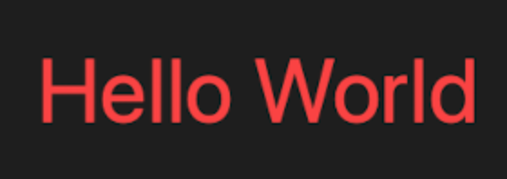
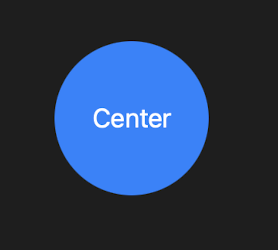
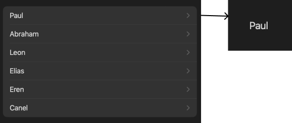

# SwiftUI Playgrounds Tests

## Declarative Syntax

**Playground Test:** Success  
**Expected Result:** The view displays a "Hello World" text with a font size of 32 and red color.  
**Code:**  
```swift
struct TextView: View {
    var body: some View {
        Text("Hello World")
            .font(.system(size: 32))
            .foregroundColor(.red)
    }
}
```
**Screenshot:**  


## VStack

**Playground Test:** Success  
**Expected Result:** Elements are stacked vertically, aligned to the leading edge, with a spacing of 10 between each item. The view displays items labeled "Item 1" to "Item 10".  
**Code:**  
```swift
struct VStackView: View {
    var body: some View {
        VStack(
                alignment: .leading,
                spacing: 10
            ) {
                ForEach(
                    1...10,
                    id: \.self
                ) {
                    Text("Item \($0)")
                }
            }
    }
}
```
**Screenshot:**  


## HStack

**Playground Test:** Success  
**Expected Result:** Elements are stacked horizontally, aligned to the top, with a spacing of 10 between each item. The view displays items labeled "Item 1" to "Item 5".  
**Code:**  
```swift
struct HStackView: View {
    var body: some View {
        HStack(
                alignment: .top,
                spacing: 10
            ) {
                ForEach(
                    1...5,
                    id: \.self
                ) {
                    Text("Item \($0)")
                }
            }
    }
}
```
**Screenshot:**  


## ZStack

**Playground Test:** Success  
**Expected Result:** Elements are stacked on top of each other. The view displays a blue circle with a diameter of 100, and the text "Center" is displayed in white at the center of the circle.  
**Code:**  
```swift
struct ZStackView: View {
    var body: some View {
        ZStack {
            Circle()
                .fill(Color.blue)
                .frame(width: 100, height: 100)
            Text("Center")
                .foregroundColor(.white)
        }
    }
}
```
**Screenshot:**  


## State

**Playground Test:** Success  
**Expected Result:** The button toggles between "Play" and "Pause" when clicked. The view correctly manages and displays the state.  
**Code:**  
```swift
struct PlayButton: View {
    @State private var isPlaying: Bool = false // Create the state.

    var body: some View {
        Button(isPlaying ? "Pause" : "Play") { // Read the state.
            isPlaying.toggle() // Write the state.
        }
    }
}
```
**Screenshot:**  


## Binding

**Playground Test:** Success  
**Expected Result:** The `PlayerView` contains a text displaying "New episode", and a button that toggles between "Play" and "Pause" based on the bound `isPlaying` state. The state changes are correctly reflected in both the `PlayerView` and the `PlayButton` view.  
**Code:**  
```swift
struct PlayButton: View {
    @Binding var isPlaying: Bool

    var body: some View {
        Button(isPlaying ? "Pause" : "Play") {
            isPlaying.toggle()
        }
    }
}

struct PlayerView: View {
    @State var isPlaying: Bool = false

    var body: some View {
        VStack {
            Text("New episode")
                .foregroundStyle(isPlaying ? .primary : .secondary)
            PlayButton(isPlaying: $isPlaying)
        }
    }
}
```
**Screenshot:**  


## StateObject

**Playground Test:** Success  
**Expected Result:** The `MyView` displays the text from the `DataModel`'s `name` property, and updates when the data model changes. The `MySubView` is correctly injected with the environment object.  
**Code:**  
```swift
class DataModel: ObservableObject {
    @Published var name = "Some Name"
    @Published var isEnabled = false
}

struct MySubView: View {
    var body: some View {
        Text("Subview")
    }
}

struct MyView: View {
    @StateObject private var model = DataModel() // Create the state object.

    var body: some View {
        Text(model.name) // Updates when the data model changes.
        MySubView()
            .environmentObject(model)
    }
}
```
**Screenshot:**  


## ObservedObject

**Playground Test:** Success  
**Expected Result:** The `MyView` displays the text from the `DataModel`'s `name` property, and updates when the data model changes. The `MySubView` observes changes in the `DataModel` and displays a toggle that reflects and changes the `isEnabled` state.  
**Code:**  
```swift
class DataModel: ObservableObject {
    @Published var name = "Some Name"
    @Published var isEnabled = false
}

struct MyView: View {
    @StateObject private var model = DataModel()

    var body: some View {
        Text(model.name)
        MySubView(model: model)
    }
}

struct MySubView: View {
    @ObservedObject var model: DataModel

    var body: some View {
        Toggle(model.isEnabled ? "Enabled" : "Disabled", isOn: $model.isEnabled)
    }
}
```
**Screenshot:**  


## EnvironmentObject

**Playground Test:** Success  
**Expected Result:** The `MyView` displays the text from the `DataModel`'s `name` property, and updates when the data model changes. The `MySubView` correctly receives the `DataModel` environment object and displays a toggle that reflects and changes the `isEnabled` state.  
**Code:**  
```swift
class DataModel: ObservableObject {
    @Published var name = "Some Name"
    @Published var isEnabled = false
}

struct MyView: View {
    @StateObject private var model = DataModel()

    var body: some View {
        Text(model.name)
        MySubView()
            .environmentObject(model)
    }
}

struct MySubView: View {
    @EnvironmentObject var model: DataModel

    var body: some View {
        Toggle(model.isEnabled ? "Enabled" : "Disabled", isOn: $model.isEnabled)
    }
}
```
**Screenshot:**  


## Button Part I

**Playground Test:** Success  
**Expected Result:** The button displays "Sign In" and triggers the `signIn` action when pressed.  
**Code:**  
```swift
struct ButtonView: View {
    var body: some View {
        Button(action: signIn) {
            Text("Sign In") // Only Title

            // Label("Sign In", systemImage: "arrow.up")
            // Title and an icon
        }
    }

    func signIn() {
        // do something
    }
}
```
**Screenshot:**  


## Button Part II

**Playground Test:** Success  
**Expected Result:** The button displays "Delete" with a destructive role and triggers the `delete` action when pressed.  
**Code:**  
```swift
struct ButtonView: View {
    var body: some View {
        Button("Delete", role: .destructive, action: delete)
    }

    func delete() {
        // do something
    }
}
```
**Screenshot:**  


## Button Part III

**Playground Test:** Success  
**Expected Result:** The button displays "Sign In", has a bordered style, and triggers the `signIn` action when pressed.  
**Code:**  
```swift
struct ButtonView: View {
    var body: some View {
        Button("Sign In", action: signIn)
            .buttonStyle(.bordered)
    }

    func signIn() {
        // do something
    }
}
```
**Screenshot:**  


## TextField

**Playground Test:** Success  
**Expected Result:** The text field accepts user input, displaying the placeholder "User name (email address)". It disables autocapitalization and autocorrection. The entered text is displayed below the text field in blue.  
**Code:**  
```swift
struct TextFieldView: View {
    @State private var username: String = ""

    var body: some View {
        TextField(
            "User name (email address)",
            text: $username
        )
        .onSubmit {
            // validate(name: username)
        }
        .textInputAutocapitalization(.never)
        .disableAutocorrection(true)
        .border(.secondary)

        Text(username)
            .foregroundColor(.blue)
    }
}
```
**Screenshot:**  


## Slider

**Playground Test:** Success  
**Expected Result:** The slider allows adjustment of the `speed` value between 0 and 100. The current value is displayed below the slider, with the color changing to red when the slider is being dragged and blue when it is not.  
**Code:**  
```swift
struct SliderView: View {
    @State private var speed = 50.0
    @State private var isEditing = false

    var body: some View {
        VStack {
            Slider(
                value: $speed,
                in: 0...100,
                onEditingChanged: { editing in
                    isEditing = editing
                }
            )
            Text("\(speed)")
                .foregroundColor(isEditing ? .red : .blue)
        }
    }
}
```
**Screenshot:**  


## Toggle

**Playground Test:** Success  
**Expected Result:** The toggle allows the user to enable or disable the "Vibrate on Ring" option, reflecting the state of `vibrateOnRing`.  
**Code:**  
```swift
struct SliderView: View {
    @State private var vibrateOnRing = false

    var body: some View {
        Toggle(isOn: $vibrateOnRing) {
            Text("Vibrate on Ring")
        }
    }
}
```
**Screenshot:**  


## System Images

**Playground Test:** Success  
**Expected Result:** The view displays a system symbol image with the name "multiply.circle.fill".  
**Code:**  
```swift
struct SystemImagesView: View {
    var body: some View {
        // Create a system symbol image.
        Image(systemName: "multiply.circle.fill")
    }
}
```
**Screenshot:**  


## Navigations

**Playground Test:** Success  
**Expected Result:** The view displays a list of names. Each name is a navigation link that, when clicked, navigates to a detail view displaying the name.  
**Code:**  
```swift
struct NavigationExampleView: View {
    var names: [String] = ["Paul", "Abraham", "Leon", "Elias", "Eren", "Canel"]

    var body: some View {
        NavigationStack {
            List(names, id: \.self) { name in
                NavigationLink(name, value: name)
            }
            .navigationDestination(for: String.self) { name in
                Text(name)
            }
        }
    }
}
```
**Screenshot:**  


## TabView

**Playground Test:** Success  
**Expected Result:** The view displays a tab view with two tabs. The first tab shows "First Tab" with a badge "2" and a "1.circle" icon. The second tab shows "Second Tab" with a badge "!" and a "2.circle" icon.  
**Code:**  
```swift
struct TabViewExample: View {
    var body: some View {
        TabView {
            Text("First Tab")
                .badge("2")
                .tabItem {
                    Image(systemName: "1.circle")
                    Text("First")
                }
            Text("Second Tab")
                .badge("!")
                .tabItem {
                    Image(systemName: "2.circle")
                    Text("Second")
                }
        }
    }
}
```
**Screenshot:**  


## Rotation Effects

**Playground Test:** Success  
**Expected Result:** The view displays an arrow icon that rotates 90 degrees when tapped, with an animation easing in and out.  
**Code:**  
```swift
struct BasicAnimationView: View {
    @State private var isRotated = false

    var body: some View {
        Image(systemName: "arrow.right.circle.fill")
            .rotationEffect(.degrees(isRotated ? 90 : 0))
            .animation(.easeInOut, value: 1)
            .onTapGesture {
                isRotated.toggle()
            }
    }
}
```
**Screenshot:**  


## Scale Effects

**Playground Test:** Success  
**Expected Result:** The view displays a star icon that scales up by 0.5 each time the "Animate" button is pressed, with an animation easing in and out.  
**Code:**  
```swift
struct AnimationView: View {
    @State private var scale: CGFloat = 1.0

    var body: some View {
        VStack {
            Image(systemName: "star.fill")
                .scaleEffect(scale)
                .animation(.easeInOut, value: 1)
            Button("Animate") {
                scale += 0.5
            }
        }
    }
}
```
**Screenshot:**  

